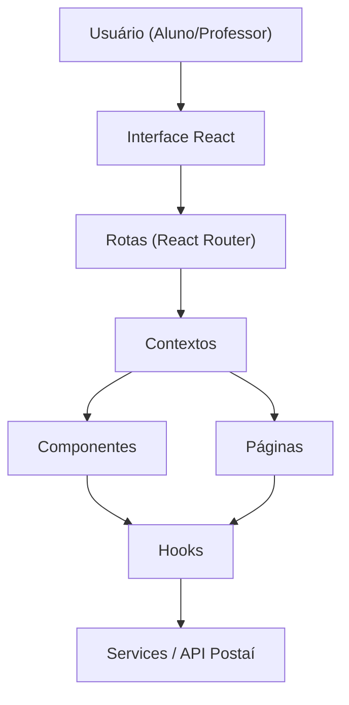

<h1 align="center">📚 Postaí Frontend</h1>

  Interface web do projeto <b>Postaí</b>, desenvolvida no curso <b>FullStack - FIAP</b>.

  
  
  
  
  

---

## 🎯 Objetivo

Este repositório contém o **frontend** do projeto **Postaí**, parte do Tech Challenge Fase 3 da FIAP.  
O objetivo é entregar uma interface **responsiva, acessível e intuitiva**, permitindo a interação com os endpoints REST do backend:

- 👩‍🏫 Professores → Criar, editar e excluir postagens.
- 👨‍🎓 Alunos → Visualizar e pesquisar conteúdos.
- 🔒 Autenticação → Login e cadastro de usuários.

---

## Setup

- yarn install
- yarn dev

## 🧰 Funcionalidades

| Página / Recurso          | Descrição                                                               |
| ------------------------- | ----------------------------------------------------------------------- |
| **/**                     | Login / Cadastro                                                          | 
| **/aulas**                | Exibe todas as aulas.                                                   |
| **/aula/:id**             | Acessa a aula escolhida.                                                |
| **/aula/criar**           | Cria uma nova aula.                                                     |
| **/dashboard**            | Dashboard do professor (visualiza, edita, deleta e cria aula.)           |

---

## 🏗️ Arquitetura do Frontend

Arquitetura:

