<h1 align="center">📚 Postaí Frontend</h1>

  Interface web do projeto <b>Postaí</b>, desenvolvida no curso <b>FullStack - FIAP</b>, onde professores podem compartilhar conteúdos e alunos podem visualizar e interagir com posts.

  
  
  
  
  
  

---

## 🎯 Objetivo

Este repositório contém o **frontend** do projeto **Postaí**, parte do Tech Challenge Fase 3 da FIAP.  
O objetivo é entregar uma interface **responsiva, acessível e intuitiva**, permitindo a interação com os endpoints REST do backend:

- 👩‍🏫 Professores → Criar, editar e excluir postagens.
- 👨‍🎓 Alunos → Visualizar e pesquisar conteúdos.
- 🔒 Autenticação → Login e cadastro de usuários.

---

## 🧰 Funcionalidades

| Página / Recurso          | Descrição                                                               |
| ------------------------- | ----------------------------------------------------------------------- |
| **Home (Lista de posts)** | Exibe todos os posts com título, autor e resumo. Inclui campo de busca. |
| **Leitura de post**       | Exibe conteúdo completo. (Comentários: opcional).                       |
| **Criação de post**       | Professores autenticados podem criar novos posts.                       |
| **Edição de post**        | Professores podem editar posts existentes.                              |
| **Administração**         | Professores podem listar, editar e excluir posts.                       |
| **Autenticação**          | Cadastro e login de usuários (com permissão de professor/aluno).        |

---

## 🏗️ Arquitetura do Frontend

A aplicação segue uma arquitetura baseada em **camadas e organização modular**:

```mermaid
flowchart TB
  A["Usuário (Aluno/Professor)"] --> B["Interface React"]
  B --> C["Rotas (React Router)"]
  C --> D["Páginas (pages/)"]
  D --> E["Componentes (components/)"]
  D --> F["Layout (layout/)"]
  D --> G["Hooks & Contexts"]
  G --> H["Gerenciamento de Estado"]
  D --> I["Axios Service / API Postaí"]
  I --> J["Backend - Postaí API"]
```

# tech-chanllenge-frontend
